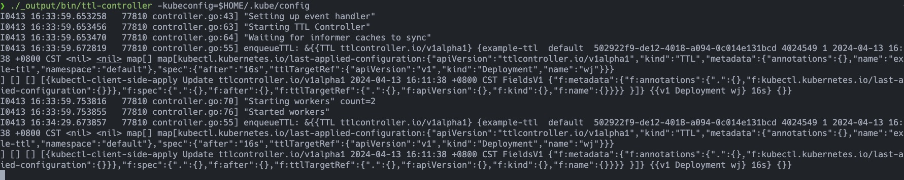

# TTL Controller
<p align="center">
    <a href="https://github.com/enamespace/ttl-controller/graphs/contributors" alt="Contributors">
        </a>
    <a href="https://github.com/enamespace/ttl-controller/pulse" alt="Activity">
        </a>
    <a></a>
</p>

# Purpose
To be familiar with k8s opeator
# Running
```
cd ttl-controller
make 
./_output/bin/ttl-controller -kubeconfig=$HOME/.kube/config 
```
